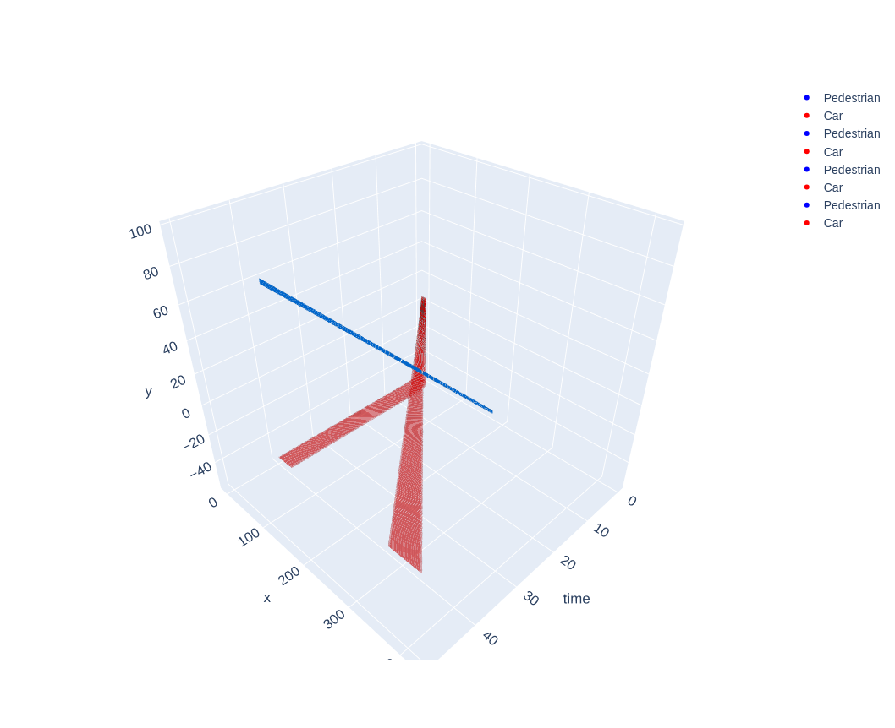
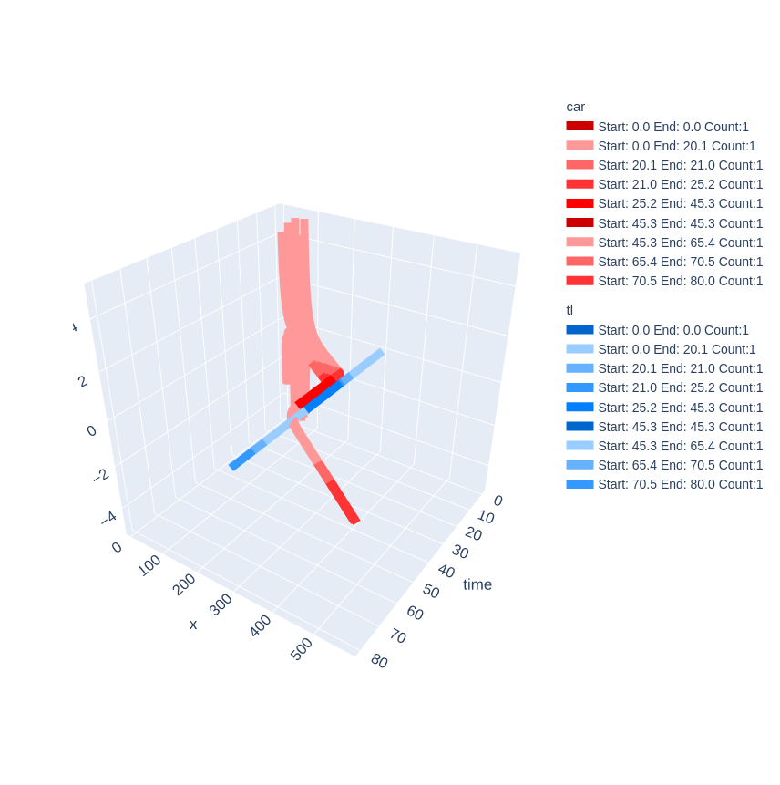

# MP0

## Problem 3

### A

The highest $$R_i$$ I reach is $$R_3$$.

Here is the reachability plot from `verify_refine()`:



### B

The average speed I achieve is $$7.985$$.

The output of simulation is:

```text
No Unsafety detected!🥰
Overall average velocity over 100 safe executions is 7.985213144490009. This is above the threshold of 7!😋
```

### C

To achieve safety, my DL use `HardBrake` to decelerate as fast as possible,
when the car is close enough to the pedestrian.

To reach higher average speed, my DL use the lowest distance threshold to start decelerating.

## Problem 5

### A

The highest $$R_i$$ I reach is $$R_3$$.

Here is the simulation plot:



### B

The average speed I achieve is $$7.985$$.

The output of simulation is:

```text
No Unsafety detected!🥰
Overall average velocity over 50 safe executions is 6.566738024693409. This is above the threshold of 6.5!😋
```

### C

My DL uses `HardBrake` to decelerate as fast as possible,
when the car is going to enter the Entrance region and the TL is red.

It uses `Accel` to gain a high speed,
which prevents the car to be slow at the Exit region.